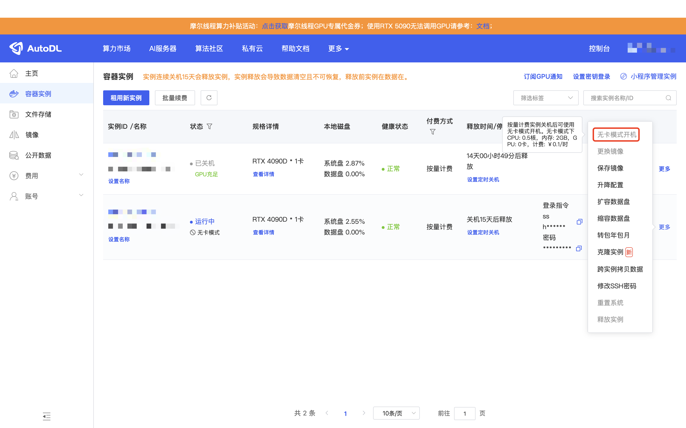
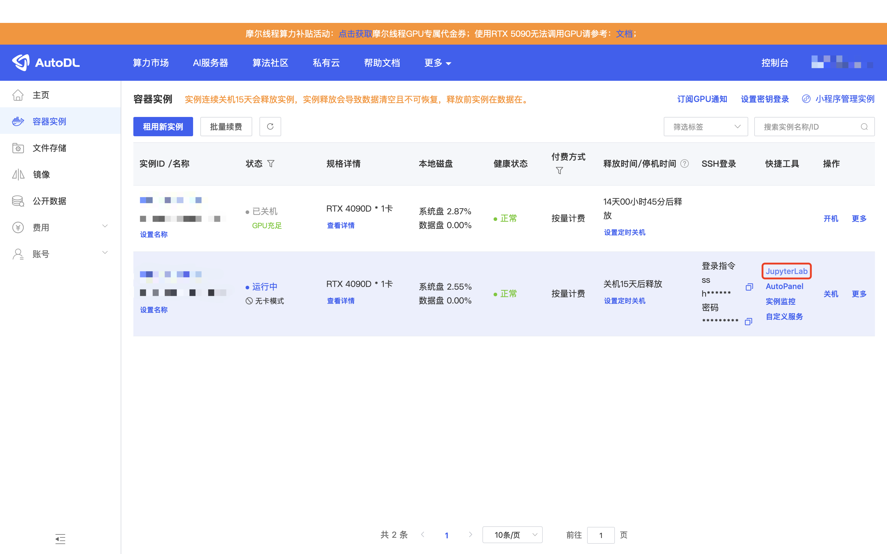
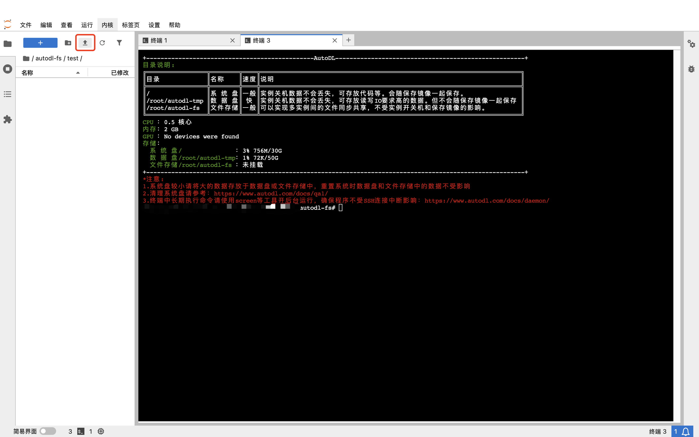
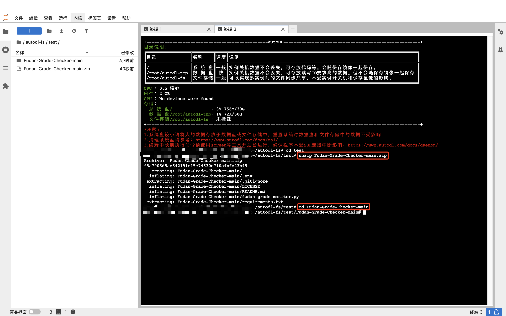
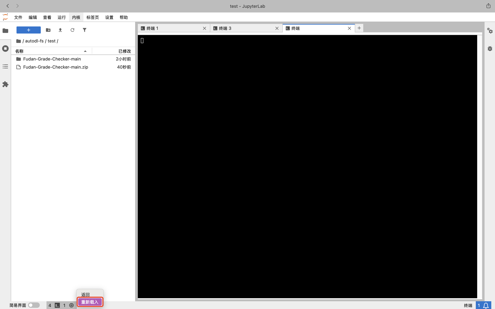
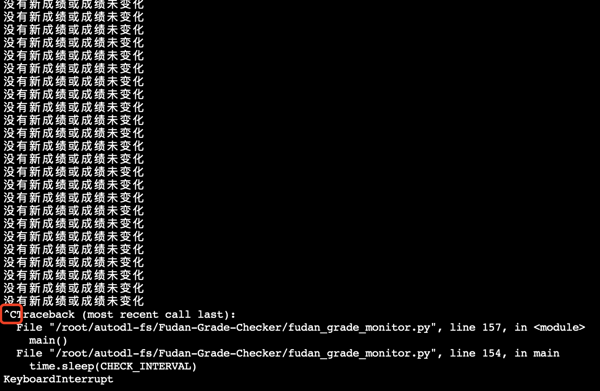
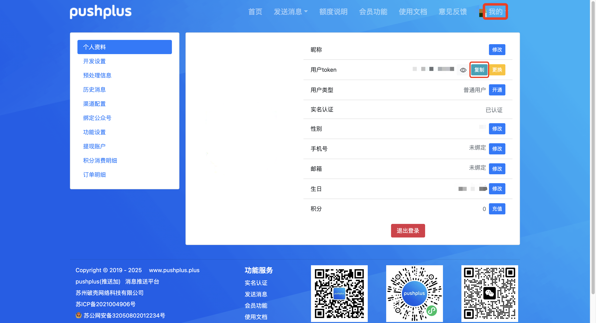

# Fudan-Grade-Checker

Fudan-Grade-Checker 是一个自动监控复旦大学教务系统成绩变动并通过 PushPlus 微信推送通知的脚本。

## 目录
- [功能简介](#功能简介)
- [使用方法](#使用方法)
  - [1. 获取代码](#1-获取代码)
  - [2. 部署环境](#2-部署环境)
  - [3. 配置环境变量](#3-配置环境变量)
  - [4. 运行脚本](#4-运行脚本)
  - [5. PushPlus获取方法](#5-pushplus获取方法)
- [注意事项](#注意事项)
- [License](#license)

## 功能简介
- 自动登录复旦大学教务系统
- 定时检查成绩更新
- 成绩变动时通过 PushPlus 微信推送通知
- 支持自定义检查间隔

## 使用方法

> *本指南适用于不熟悉 git、云服务器等操作的同学，专业用户可自行调整。*

### 1. 获取代码

**方式一：使用 git 克隆**
```bash
git clone https://github.com/YoyoDiandian/Fudan-Grade-Checker.git
cd Fudan-Grade-Checker
```

**方式二：下载压缩包**
在 GitHub 页面点击 `Code` → `Download ZIP`。


### 2. 部署环境

以 AutoDL 云服务器为例：

1. 登录 [AutoDL](https://www.autodl.com) 并扫码进入。
2. 购买实例，选择任意配置，支付后默认开机。在`容器实例`中先关机。
3. 在"更多"中点击“无卡模式开机”，等待状态变为“运行中”。
   
4. 进入“JupyterLab”界面。
   
5. 上传并解压代码包：
   - 点击左上角上传按钮（向上箭头图标）上传 zip 包。
     
   - 在 JupyterLab 终端输入：
     ```bash
     unzip Fudan-Grade-Checker-main.zip
     cd Fudan-Grade-Checker-main
     ```
     
   - 如终端卡死，点右下角“重载”。
     
6. 安装依赖：
   ```bash
   pip install -r requirements.txt
   ```

### 3. 配置环境变量

在项目根目录下新建或编辑 `.env` 文件，内容如下：

```
USERID=2230xxx0abc
PASSWORD=123456
PUSHPLUS_TOKEN=aaaaaaaaaaaaaa
CHECK_INTERVAL=300
```

- `USERID`：复旦大学统一身份认证学号
- `PASSWORD`：统一身份认证密码
- `PUSHPLUS_TOKEN`：PushPlus 推送 token（[获取方法](#5-pushplus获取方法)）
- `CHECK_INTERVAL`：成绩检查间隔（秒），默认 300 秒（5 分钟）

*小白指南：*
可用如下命令创建 `.env` 文件：
```bash
echo USERID=你的学号 > .env
echo PASSWORD=你的密码 >> .env
echo PUSHPLUS_TOKEN=你的推送token >> .env
echo CHECK_INTERVAL=300 >> .env
```

### 4. 运行脚本

在终端中运行：
```bash
python fudan_grade_monitor.py
```

脚本会自动定时检查成绩并推送通知。

退出脚本：在终端中按 `Ctrl+C`


### 5. PushPlus获取方法
1. 访问 [PushPlus官网](https://www.pushplus.plus/)，点击右上角的"登录"。

2. 使用微信扫码登录。

3. 登录后，点击头像"我的"。

4. 在页面顶部可以看到你的 token，复制这个 token 到 `.env` 文件中的 `PUSHPLUS_TOKEN` 字段。



> 注意：请妥善保管你的 token，不要分享给他人。

## 注意事项
- 请勿将 `.env` 文件上传到公共仓库，避免泄露个人信息。
- 本项目仅供学习交流使用，请遵守相关法律法规和学校规定。

## License

MIT License
